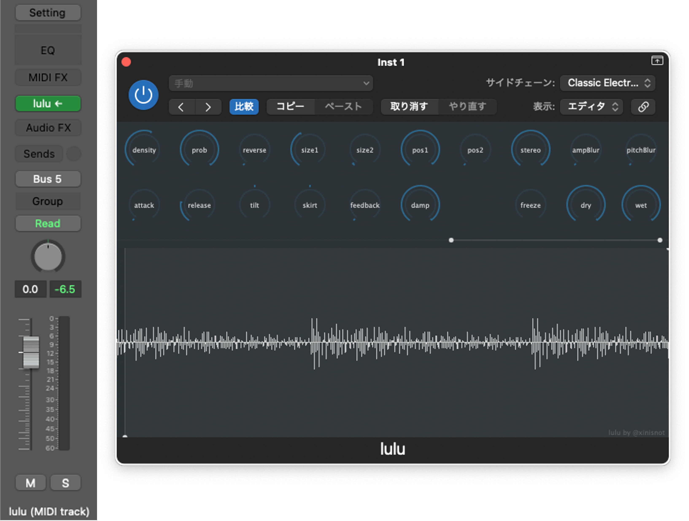

# lulu
**lulu** is MIDI-controlled live-granular effect. When receives MIDI note-on message, lulu starts to generate grains from a loop-recording buffer of 5 secs. According to received MIDI note number, grains can be pitch-shifted.

## About GUI
By double-clicking each dials, a number box which lets you tweak values will appear. 

Two range-bars positioned in lower half are linked to the following dial.

* size1, size2
* pos1, pos2

Input sound is displayed on the oscilloscope.

# How to use
Although lulu is an audio effect plugin, it must receive MIDI note-on message in order to sound. Middle C is the standard for grain pitch, and no pitch shift occurs.

## Example. Apple Logic
Make a MIDI track and write notes in the MIDI regions. Select lulu from the “AU MIDI-controlled Effects” as the instruments for the made track. In the “Side Chain”, select the track to which you want to apply lulu.

## Example. Cycling ‘74 Max
Patch like the following.

# Parameters
Each dial is assigned to a parameter which is used for automation or mapping.

## density
* `trigger/density`
* Trigger frequency to generate grain. (unit: Hz)

## prob
* `trigger/probability`
* Probability of trigger being fired.

## reverse
* `cloud/reverse_prob`
* Probability that the playback of grains will be reversed.

## size1, size2
* `cloud/grain_size1`, `cloud/grain_size2`
* Grain size (unit: msec).
* For each grain, value is randomized in a range of two values.

## pos1, pos2
* `cloud/position1`, `cloud/position2`
* Position of recording buffer from which the grain is generated (unit: msec).
* For each grain, value is randomized in a range of two values.

## stereo
* `cloud/stereo_spread`
* Stereo-spread.

## ampBlur
* `cloud/amp_blur`
* Amplitude deviation of grains.

## pitchBlur
* `cloud/pitch_blur`
* Pitch deviation of grains (unit: cent).

## attack
* `envelope/attack`
* Attack time on note-on (unit: msec).

## release
* `envelope/release`
* Release time on note-off (unit: msec).

## tilt
* `cloud/window_tilt`
* Shape of grains.

## skirt
* `cloud/window_skirt`
* Shape of grains.

## feedback
* `feedback/amount`
* Feedback amount (unit: dB).

## damp
* `feedback/damp`
* Lowpass filter for feedback.

## freeze
* `record/freeze`
* Pause look recording.

## dry
* `mixer/dry`
* Pre Fx (unit: dB).

## wet
* `mixer/wet`
* Post Fx (unit: dB).

# About me
[xin](https://jazzy-people-25f.notion.site/xin-xinisnot-1493937677b8806aabeffdd28083cc4d)