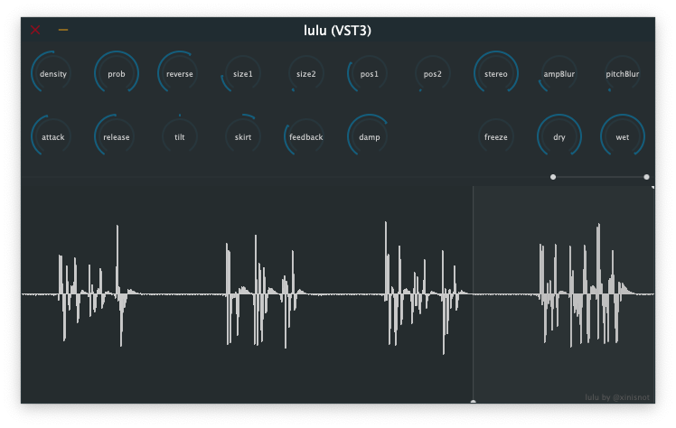
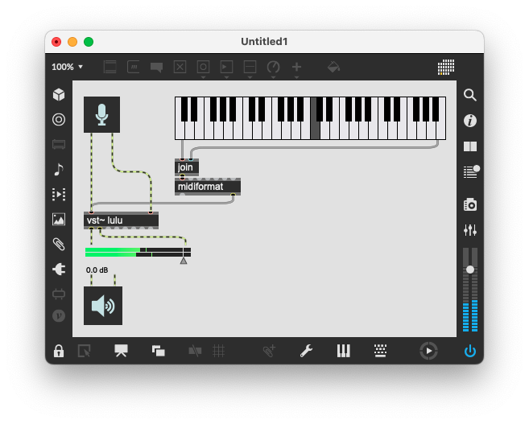

# lulu
**lulu**はMIDIで制御するライブグラニュラーエフェクトです。MIDIノートオンを受け取ると、5秒間のループ録音からグレインを生成します。MIDIノートナンバーに応じて、グレインをピッチシフトすることができます。

## GUIについて
各ダイヤルをダブルクリックすると、ナンバーボックスが現れます。数値を直接入力することで、パラメータ値の微調整ができます。

下半分に位置する2つのレンジバーは、次のダイヤルと連動しています。

* size1, size2
* pos1, pos2

入力されたサウンドはオシロスコープに表示されます。*注: 現バージョンではウィンドウを閉じるとオシロスコープの描画がリセットされますが、使用には問題ありません*。

# 使い方
luluはオーディオエフェクトプラグインですが、音を鳴らすにはMIDIノートオンメッセージを受け取る必要があります。中央ドがグレインのピッチの基準であり、ピッチシフトが起こりません。

## 例. Apple Logic
MIDIトラックを作成し、MIDIリージョンに適当なノートを書きます。作成したトラックのインストゥルメントとして、「AU MIDI制御エフェクト」からluluを選びます。「サイドチェーン」に、エフェクトをかけたいトラックを選びます。

## 例. Cycling ‘74 Max
次のようなパッチを作ってください。

# パラメータ
ダイヤルのタイトルと、オートメーションやマッピングに使用される実際のパラメータ名を併記します。

## density
* `trigger/density`
* グレインを生成するトリガーの周波数 (単位Hz)

## prob
* `trigger/probability`
* トリガーが発せられる確率

## reverse
* `cloud/reverse_prob`
* グレインが逆再生される確率

## size1, size2
* `cloud/grain_size1`, `cloud/grain_size2`
* グレインの大きさ (単位msec)
* グレインごとに、2つの値の範囲でランダマイズ

## pos1, pos2
* `cloud/position1`, `cloud/position2`
* グレインを生成する録音バッファの位置 (単位msec)
* グレインごとに、2つの値の範囲でランダマイズ

## stereo
* `cloud/stereo_spread`
* ステレオスプレッド

## ampBlur
* `cloud/amp_blur`
* グレインの振幅の偏差

## pitchBlur
* `cloud/pitch_blur`
* グレインのピッチの偏差 (単位cent)

## attack
* `envelope/attack`
* ノートオンのアタックタイム (単位msec)

## release
* `envelope/release`
* ノートオフのリリースタイム (単位msec)

## tilt
* `cloud/window_tilt`
* グレインの形状のシェイピング

## skirt
* `cloud/window_skirt`
* グレインの形状のシェイピング

## feedback
* `feedback/amount`
* フィードバック量 (単位dB)

## damp
* `feedback/damp`
* フィードバックにかかるローパスフィルタ

## freeze
* `record/freeze`
* ループ録音を一時停止

## dry
* `mixer/dry`
* プリFX (単位dB)

## wet
* `mixer/wet`
* ポストFX (単位dB)

# 制作者について
[xin](https://jazzy-people-25f.notion.site/xin-xinisnot-1493937677b8806aabeffdd28083cc4d)